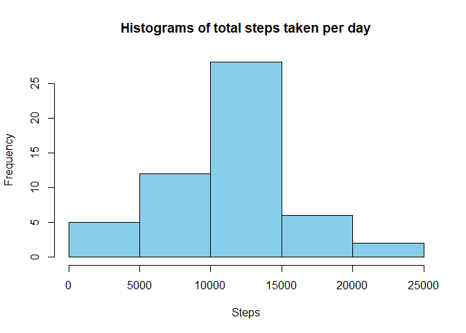
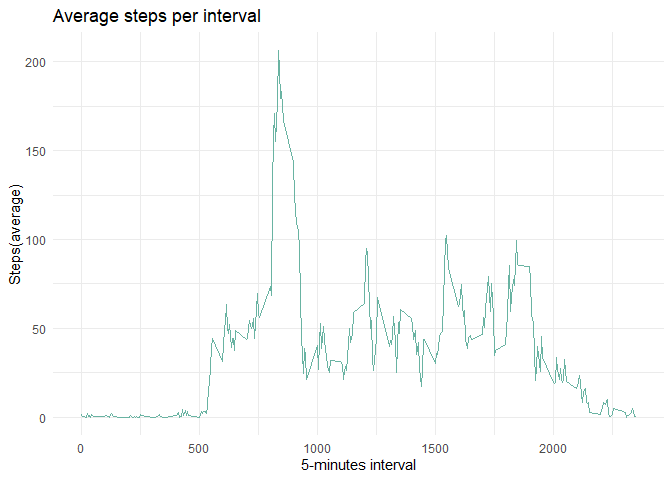
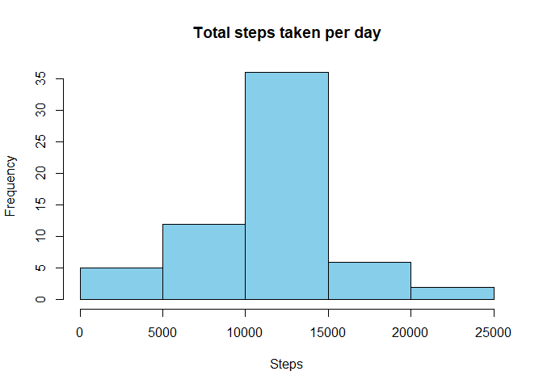
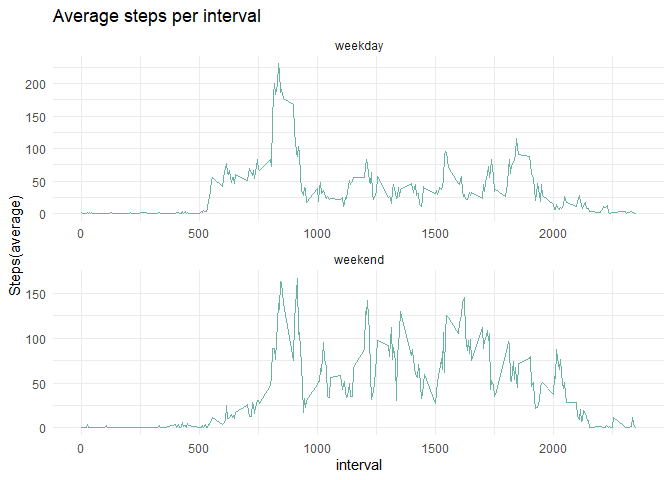

## Loading and preprocessing the data
Assuming that the file has already been downloaded and unzipped in the directory, then I read in the dataset and convert the date variable from factor to POSIXlt.


```r
#load data
activity <-read.csv("activity.csv")
#convert date from factor variable to date variable
activity$date<-as.POSIXct(activity$date)
```


## What is mean total number of steps taken per day?
First an hisogram is plotted to observe the distribution of the data and it is observed that the highest concetration of steps is between 10000 and 15000,


```r
library(dplyr)

#compute total steps per day
activity_day <- activity%>% 
          group_by(date) %>% 
          summarise(steps_total=sum(steps)) 
#plot histogram
hist(activity_day$steps_total, col="skyblue", xlab="Steps", main="Histograms of total steps taken per day")
```

<!-- -->
 
The mean and and median steps per day are calculated ignoring the missing values.  

```r
#mean
mean_activity <- mean(activity_day$steps_total, na.rm=TRUE)
#median
median_activity <- median(activity_day$steps_total, na.rm=TRUE)
```

The mean of daily steps is:

```
## [1] 10766.19
```


The median of daily steps is:

```
## [1] 10765
```


## What is the average daily activity pattern?
The average number of steps per interval can be seen in the plot below.


```r
#compute the average number of steps per interval
activity_mean<-activity%>% 
          group_by(interval) %>% 
          summarise(steps_avg=mean(steps, na.rm=TRUE)) 
#plot the average stepes per interval
          library(ggplot2)    
```

```
## Warning: package 'ggplot2' was built under R version 3.6.2
```

```r
          activity_mean%>% 
 ggplot(aes(x = interval, y = steps_avg)) +
           geom_line(color="#69b3a2") +
           ggtitle("Average steps per interval") +
           ylab("Steps(average)")+
           xlab("5-minutes interval")+
           theme_minimal()             
```

<!-- -->

The interval with maximum average number of steps is the 835


```r
activity_mean %>% 
                    top_n(1, steps_avg) %>% 
                    print(interval)
```

```
## # A tibble: 1 x 2
##   interval steps_avg
##      <int>     <dbl>
## 1      835      206.
```
## Imputing missing values

The number of missing values is 2304 as computed below.

```r
sum(is.na(activity$steps))
```

```
## [1] 2304
```

The missing values are substituted with the average for the interval.


```r
#merge the original dataset with the one with the average steps per interval
 activity_complete<-activity %>% 
                  left_join(activity_mean) 
```

```
## Joining, by = "interval"
```

```r
#substitute the NAs with the average steps per interval     
 activity_complete$steps[is.na(activity_complete$steps)]<- activity_complete$steps_avg
```

```
## Warning in activity_complete$steps[is.na(activity_complete$steps)] <-
## activity_complete$steps_avg: number of items to replace is not a multiple of
## replacement length
```


A new dataset equal to the original one but with no missing values is created.

```r
#create a dataset equal to the original one but with no missing values
 activity_complete<-activity_complete %>% 
                  select(steps,date,interval)
#Check no missing values
sum(is.na(activity_complete))
```

```
## [1] 0
```

An histogram of the total number of steps per day with the new dataset shows an increase in frequency of the days with total steps between 10000 and 15000.

```r
#calculate total number of steps per day
activity_day2 <- activity_complete%>% 
          group_by(date) %>% 
          summarise(steps_total=sum(steps)) 
          
# produce histogram
hist(activity_day2$steps_total, col="skyblue", xlab="Steps", main="Total steps taken per day")
```

<!-- -->


The mean and median are calculatede below.

```r
mean_activity2 <- mean(activity_day2$steps_total, na.rm=TRUE)
median_activity2 <- median(activity_day2$steps_total, na.rm=TRUE)

# mean
mean_activity2
```

```
## [1] 10766.19
```

```r
#median
median_activity2
```

```
## [1] 10766.19
```
Given that the missing values have been imputed using the mean value per interval, the new mean and median steps per day are the same and equal to the mean of the sample with missing values.

## Are there differences in activity patterns between weekdays and weekends?

A new factor variable indicating whether it's a weekend or a weekday was created.

```r
#generate variable with day of the week
activity_complete$day<-weekdays(activity_complete$date, abbreviate=FALSE)
#generate variable with weekend or weekday
activity_complete$we=ifelse(activity_complete$day %in% c("Saturday", "Sunday"), "weekend", "weekday")
#convert variable to factor variable
activity_complete$we<-as.factor(activity_complete$we)         
```
There seems to be a difference in pattern between weekends and weekdays.During the weekends, the number of steps tends to be more stable at around 100 for most of the intervals, while during weekdays there is a peak of roughly 200 steps at around the 700 interval and then the steps stabilize at around 80 as can be seen in the graph below.


```r
#Average actitivity
 
 activity_mean2<-activity_complete%>% 
           group_by(interval, we) %>% 
           summarise(steps_avg=mean(steps, na.rm=TRUE)) 
 
 #plot
library(ggplot2)
 
 activity_mean2 %>% 
 ggplot(aes(x = interval, y = steps_avg)) +
           geom_line(color="#69b3a2") +
           ggtitle("Average steps per interval") +
           facet_wrap(~ we, scales = "free",  ncol=1) +
           ylab("Steps(average)")+
           theme_minimal()
```

<!-- -->
